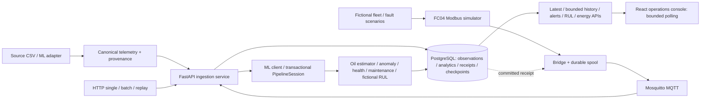

# Current architecture — Phase 0 audit

Inspected 10 October 2026 (Asia/Calcutta), `main` at `3bf835c7e373565300e395ddaca4007773ef542e`. Scope is the existing application and baseline. The sole canonical specification is [Transformer_DigitalTwin_Physics_First_Implementation_Plan.md](../Transformer_DigitalTwin_Physics_First_Implementation_Plan.md), confirmed after Phase 0. No repository `AGENTS.md` was found. See the [finalized physics contract](physics_contract.md) and [baseline report](phase0_report.md). Phase 1 adds contract documentation and validation fixtures only; the current architecture, APIs and frontend remain unchanged. The contract reserves a separate future physics resource for Phase 5; it is not a current route.

## Repository and data flow



| Location | Current responsibility |
|---|---|
| `backend/app` | FastAPI routes → services → repositories; Pydantic contracts; synchronous SQLAlchemy/psycopg, MQTT consumer, ML adapters. |
| `backend/alembic` | Migrations 0001–0004; latest adds acquisition, configuration/analytics metadata, receipt/checkpoint persistence and semantic identity. |
| `ml` | Raw data adapter, features, empirical thermal model, anomaly, health, maintenance, proxy forecast, stateful session/checkpoint, synthetic RUL and energy/loss calculations. |
| `simulator/simulator` | Canonical schemas, seeded fictional generation, fault scenarios, replay, Modbus server/map/bridge, spool, CLI and streaming. |
| `simulator/config` | Operational ten-asset roster, server/bridge policy, analytics policy and placeholder artifact directory. |
| `frontend/src` | React console, API Zod validation, polling hooks, equipment cards/charts, resource displays; preserved older educational components. |
| `tests/fixtures/hackathon` | 1.1.0 JSON schemas, positive/negative examples, arithmetic/hash/query/trace oracles and validator. |
| `docs`, `backend/docs`, `frontend/screenshots` | Prior contracts, deployment/phase evidence and historical screenshots. Historical claims are not substitutes for this baseline. |

The root README is a two-line project description. Older docs refer to Streamlit, another checkout path or six database tables. Current entry point is React, and ORM has eight domain tables: `transformers`, `telemetry`, `analytics`, `alerts`, `maintenance_records`, `ingestion_runs`, `ingestion_receipts`, `ml_checkpoints`, plus Alembic's version table.

## Backend startup and transport

[main.py](../backend/app/main.py) builds the FastAPI app, shared error handlers, request correlation and CORS middleware, mounts liveness/readiness and `/api/v1`. Lifespan optionally starts MQTT and acquires a Python-runtime lease; shutdown drains/stops the consumer and closes ML/lease resources. The stateful Python backend is restricted to one process/worker.

Local source startup from `backend/`, after installing dependencies and configuring a PostgreSQL database:

```powershell
../.venv/Scripts/python.exe -m uvicorn app.main:app --host 127.0.0.1 --port 8002
```

This is the repository's startup pattern adapted to the current checkout, not a command run by this audit. Backend defaults select `ML_BACKEND=stub`, MQTT disabled, PostgreSQL at localhost:5432, schema 1.0.0 and historical Streamlit CORS origins. Use explicit current settings for React/Python operation. `alembic upgrade head` is the deployment migration command; do not downgrade or reset a retained database. The baseline migration round-trip uses a disposable test database.

HTTP single/batch, replay and MQTT share [ingestion_service](../backend/app/services/ingestion_service.py). It recomputes semantic SHA-256, checks supplied snapshot identity, serializes asset writes and validates canonical inputs. Asset/event-time uniqueness gives exact-retry idempotence; changed semantic content conflicts. Replay destinations must be registered separately. Late observations do not advance forward ML state. Single ingestion can retain late telemetry with a `REJECTED_LATE_OBSERVATION` outcome; historical contract language describes 409 rejection, so code/contract policy needs review before future changes.

Python ML uses [transactional_ml](../backend/app/services/transactional_ml.py): restore compatible SQL checkpoint, prepare transaction-private candidate, persist telemetry/analytics/alerts/maintenance/receipt/checkpoint together, install committed state only after SQL commit, discard on rollback. ML failure may retain telemetry with explicit unavailable analytics/coverage loss. HTTP stateful ML currently reports `REMOTE_TRANSACTIONAL_STATE_UNSUPPORTED`; a legacy stub is stateless and 1.1.0 stub analytics are withheld as non-operational. Broker acknowledgment alone does not prove SQL commit; the bridge polls the receipt resource.

## Current API inventory and response formats

The table was checked against `app.openapi()` generated from the local source; it is not a frozen old OpenAPI snapshot. `T` below means `/api/v1/transformers/{id}`.

| Method/path | Current result |
|---|---|
| GET `/health`, `/health/ready` | `HealthResponse`, `ReadinessOut`; liveness may be 200 while degraded; readiness fails with 503. |
| GET/POST `/api/v1/transformers` | `Page[TransformerOut]` / created `TransformerOut`; registry supports active/all scope through configured fleet. |
| GET/PATCH `T` | `TransformerOut`; patch distinguishes omitted fields and explicit null. |
| GET `T/latest` | `LatestStateOut`: transformer, nullable telemetry/analytics, open_alerts_count, demo_mode, data_source, schema/feature/model versions, optional analytics_availability. |
| GET `T/telemetry`, `/health`, `/analytics` | `Page[TelemetryPoint|HealthPoint|AnalyticsPoint]`, nullable values preserved. |
| GET `T/trends` | Window bounds/bucket_seconds, signal buckets with avg/min/max/count, no_data_signals and protection_events. |
| GET `/api/v1/scenarios` | Paged scenario_id, first/last timestamp and row_count. |
| GET `T/alerts`, `T/maintenance` | Paged alert/maintenance resources with window/status filters. |
| GET `/api/v1/alerts/{id}`; PATCH `.../acknowledge`, `.../resolve` | `AlertOut` with lifecycle/evidence. |
| GET/PATCH `/api/v1/maintenance/{id}` | `MaintenanceOut` with status transitions. |
| POST `/api/v1/telemetry` | `IngestResult`: telemetry_id, nullable analytics, warnings, snapshot_id, ingestion_outcome, forward_state_advanced; new observation 201 omits duplicate, retry 200 includes duplicate. OpenAPI has no typed response schema here. |
| POST `/api/v1/telemetry/batch` | `IngestionSummary`: run_id, row/insert/duplicate/parse-error/out-of-range counts and sampled errors. Default maximum batch 5000. |
| POST `/api/v1/simulate/replay`; GET `.../{run_id}` | Accepted run_id / `ReplayStatusOut` with RUNNING/COMPLETED/FAILED, counts, quality/gaps, source and timestamps. |
| GET `/api/v1/ingestion/status` | Bounded ingestion diagnostics; dynamic dictionary response. |
| GET `/api/v1/ingestion/receipts/{snapshot_id}` | Attempt/accepted hashes, identity/event/received/commit times, COMMITTED/CONFLICT, ingestion/analytics status and coverage loss; absent/pending receipt 404. Dynamic response. |
| GET `/api/v1/ingest/mqtt/status` | `MqttStatus`: enabled/connection state, topic/broker configuration, counts, times and rejection diagnostics. |
| GET `T/rul` | `{transformer_id,timestamp,rul,schema_version}`; saved fictional result or null. |
| GET `T/rul/projection` | Identity/time, projected_curve of elapsed_hours/degradation, threshold/unit/horizon and version; persisted checkpoint must match RUL event time. |
| GET `T/energy` | Bounded energy object with consumption/covered energy/import/export/peaks, losses/efficiency/savings, status/method, coverage/gaps/resets, assumptions/limitations/provenance and versions. |
| POST `/api/v1/admin/demo/reset` | `DemoResetOut`; disabled by default, token guarded, refuses production. Not invoked on retained services in Phase 0. |

Pages are `{items,total,limit,offset}`. History supports aware `from`/`to`, `anchor=latest|now`, bounded limits and telemetry projection; telemetry/analytics accept order. Default window is 24 h, maximum 31 days, maximum page limit 5000. Inspect [query dependencies](../backend/app/api/v1/query_dependencies.py) and [query schemas](../backend/app/schemas/query.py) for route-specific defaults. Alerts/maintenance use ascending API ordering; the UI retrieves the newest bounded page ranges explicitly. Trends bucket numeric signals; null gaps are not zero-filled. Energy defaults to 1 h with choices 1h/6h/24h/7d; explicit bounds override duration. Unknown asset is 404.

Errors normally use `{error:{code,message,details}}`, shared validation 422, identity conflicts 409 and unexpected errors 500; request ID is in `X-Request-ID` and correlated details. [Source-generated routes](../backend/app/api/v1/router.py) and [error handlers](../backend/app/core/errors.py) remain authoritative. Some dynamic resources lack OpenAPI response schemas; fixture/frontend contracts provide additional checks.

## Telemetry, thermal and analytics

The [physics draft](physics_contract.md) lists every input unit, range, provenance field, physical unknown and the full existing thermal equation/defaults. The empirical model predicts oil-indicator response from prior ambient/current-squared forcing with elapsed-time exponential integration. It is not a hot-spot solver; source temperature units are unverified by default. State is isolated per asset and continuity/warm-up rules are explicit. Precomputed J/power fallback and standards-inspired mode naming are audit concerns, not evidence of physical eligibility.

Anomaly severity linearly interpolates between directional warning/critical references and clips to [0,1]. It groups thermal/electrical/loading/oil/protection evidence, tracks coverage and uses three observations spanning at least 0.5 h (gaps at most 0.5 h); mean-current gate is 5 A, coded activation threshold 0.5. Active eligible protection bypasses statistical persistence. Negative thermal residual means mismatch, not overheating. Default statistical thresholds claim training-reference provenance in code, but the original training artifacts/data were not available to verify that provenance.

| Default signal | Warning → critical | Unit / direction |
|---|---|---|
| current_imbalance_pct | 72.9802 → 300 | percent, upper |
| voltage_imbalance_pct | 1.7494 → 2.5694 | percent, upper |
| neutral_current_magnitude | 51.4 → 71.08 | A, upper |
| apparent_power_total | 101.5068 → 118.02 | kVA, upper |
| power_factor_deviation | 0.04 → 0.0533 | dimensionless, upper |
| oil_temperature | 40 → 48 | source_unit, upper |
| oil_temperature_rate | 8 → 20 | source_unit/hour, upper |
| temperature_rolling_std | 2.0817 → 14.5 | source_unit, upper |
| thermal_residual | 4.4558 → 8.0647 | source_unit, upper |
| oil_level_deviation | -2.75 → -12.75 | source_unit, lower |

Sources: [anomaly detector](../ml/anomaly/detector.py), [health engine](../ml/health/engine.py), [maintenance engine](../ml/maintenance/engine.py), [orchestrator](../ml/pipeline/orchestrator.py). Health uses weights thermal .30, electrical .20, loading .10, oil .15, alarm .20, anomaly .05; reweights available components and reports coverage. Alarm scores are clear 100/alarm 40/trip 0. Persistent eligible conditions cap the weighted score at 20 plus the minimum eligible component score; active trip overrides to zero. Maintenance has independent persistence/trip latching; gaps or missing contacts cannot automatically clear protection context.

Backend alert policy defaults are health warning/critical 60/40, anomaly critical .9, proxy-risk warning/critical .5/.8 and clear-after-five records. They are software policy, not certified thermal safety limits. Release gating keeps unsupported operational fault outputs null. Strict fitted mode verifies manifest/parameter integrity and compatibility, not field accuracy; demo mode explicitly uses unverified coded configuration. Component readiness is separate from overall inference status.

[RUL](../ml/rul/model.py) integrates a fictional degradation state and declared future rates; operational thermal ageing merely assesses prerequisites and withholds life values. No physical life estimate or FEM solver was found. [Energy](../ml/energy/calculation.py) uses explicit source/sign/counter policy, trapezoidal power integration or eligible counter differences, bounded windows and partial coverage. Optional [loss approximation](../ml/energy/loss.py) uses P0 + rated-load-loss times phase-average squared current ratio, with linear current integration, applicable side/units, energized state and output boundary required. Efficiency is 100·delivered_power/(delivered_power+loss), unavailable when unsupported; it is not measured savings.

## Simulator, fixtures and evidence

The operational roster is ten fictional Bengaluru-named identities, not real connected transformers. Generation declares synthetic LV units/provenance, event cadence and seeded scenarios; WTI is null/status. Synthetic oil starts at 42 DEG_C, targets ambient + 25·loading², and uses a 1200 s exponential time constant. These are demo choices, independently different from the empirical estimator, not physical calibration/validation.

The fictional FC04 map uses `fictional-lv-v1`, quality bits, event time, sequence/identity and explicit scales. Missing register storage can contain zero while the absent quality bit decodes to null; unverified values are unavailable on this declared map. No OEM production addresses are inferred. Replay retains original event time and separate asset lineage; bridge spools until a committed receipt. See [codec](../simulator/simulator/register_map.py), [bridge](../simulator/simulator/modbus_bridge.py), [spool](../simulator/simulator/spool.py).

The fixture validator passed 10 schemas/57 positive-negative examples, 13 arithmetic/eligibility cases, 10 traces and 3 hash vectors. This checks contracts and synthetic arithmetic, not real sensor accuracy. Current checkout lacks `data/processed/release_manifest.json` and expected fitted parameter JSON; `simulator/config/artifacts` contains only README. Historical ML release docs claiming artifacts are present do not match this checkout.

## Frontend appearance and extension points

[main.tsx](../frontend/src/main.tsx) imports global CSS and mounts React StrictMode → [App](../frontend/src/App.tsx) → [MonitoringConsole](../frontend/src/components/console/MonitoringConsole.tsx). Tooling: React 19, TypeScript, Vite 8, Tailwind v4 plugin, Lucide icons, Zod, Vitest/jsdom. The active console's own CSS overrides the older dark marketing styles.

The console is a light gray-blue workspace with white bordered cards, a fixed navy left sidebar (216 px desktop), blue-gray type, compact 13 px Inter/Segoe UI typography, small badges, a white top bar and blue charts. Navigation is Overview, Transformer monitoring, Live alarms/events, Thermal & loading, Predictive maintenance and System/source health. Overview has summary cards, search/status/alarm filters, five asset cards per page, pagination and refresh. Detail preserves an equipment illustration flanked by readings, source/quality strip, feature cards, trends and event tables. Maintenance hosts existing health/recommendation/RUL/energy/nameplate cards. At 760 px the sidebar collapses behind a menu and layouts stack; an intermediate 1200 px breakpoint reduces columns.

Appearance evidence: source/CSS and the existing [ten-asset detail screenshot](../frontend/screenshots/operational-ten/detail.png) were inspected. That screenshot is prior evidence, not a newly captured live verification. Live CUA inspection was attempted but blocked by the sandbox initialization failure. No visual redesign or pixel comparison is claimed.

Possible future additions: hot-spot estimate/status within the existing thermal panel, provenance/assumptions in the source-strip disclosure, eligible ageing next to existing resource cards, and an explicitly available FEM comparison in the thermal chart area. Reuse cards/type/spacing; do not remount older marketing/studio components or add decorative controls. No such addition is made in Phase 0.

The frontend obtains monitoring values from APIs, validates shapes/asset identity, times out after 10 s, aborts superseded requests and surfaces errors/retained stale data. It performs no physics or rating fallback calculation. Registry polls every 60 s; visible cards every 15 s, concurrency at most three; selected latest defaults 3 s (2–5 s clamp); active history every 15 s (newest 300 rows, 1 h); alerts/maintenance latest 30 in 24 h; MQTT every 15 s; maintenance RUL every 15 s and projection/energy every 30 s. Demo event staleness defaults 10 s. No SSE/WebSocket endpoint exists.

Controls inspected in source include navigation, mobile menu, refresh/retry, asset selection, search/page filters, previous/next, trend selection and evidence disclosures. The 50 existing frontend tests pass; this is not an exhaustive live-control/end-to-end claim. Existing browser helpers depend on a temporary Playwright installation/Edge and save over historical evidence, so they were not run in this audit.

## Environment and deployment inventory

Inspect [Settings](../backend/app/core/config.py), [frontend example](../frontend/.env.example), [Compose](../docker-compose.yml), [H06 example](../.env.h06.example) and [existing-runtime overlay](../docker-compose.operational-existing.yml). No private `.env` contents were printed or overwritten.

| Area | Environment variables / behavior |
|---|---|
| Database/API | `DATABASE_URL`, `ENV`, `LOG_LEVEL`, `SCHEMA_VERSION`, `DEFAULT_TRANSFORMER_ID`, `CORS_ORIGINS`, `MAX_BATCH_SIZE`, `DEFAULT_WINDOW_HOURS`, `MAX_WINDOW_DAYS`, `MAX_PAGE_LIMIT`. |
| ML/state/policy | `ML_BACKEND`, `ML_HTTP_URL`, `ML_PYTHON_ENTRYPOINT`, `ML_HISTORY_WINDOW` (cap 4096), `ML_TIMEOUT_SECONDS`, `ML_MAX_RETRIES`, `ML_RUNTIME_WORKERS`, `WEB_CONCURRENCY` (one for Python mode), `ML_RUNTIME_MODE`, `ML_ARTIFACT_DIR`, `ANALYTICS_POLICY_FILE`, `OPERATIONAL_FLEET_FILE`. |
| Alerts | `ALERT_HEALTH_WARN/CRIT`, `ALERT_ANOMALY_CRITICAL`, `ALERT_FAULT_RISK_WARN/CRIT`, `ALERT_AUTO_RESOLVE_AFTER`, `ALERT_REASON_SEVERITY`. |
| MQTT | `MQTT_ENABLED`, `MQTT_HOST`, `MQTT_PORT`, `MQTT_USERNAME/PASSWORD`, `MQTT_CLIENT_ID`, `MQTT_TOPIC`, `MQTT_QOS`, `MQTT_QUEUE_MAX`, `MQTT_SOURCE_NAME`, `MQTT_RECONNECT_MIN_S/MAX_S`. Default queue 10000 and QoS 1. |
| Demo/admin | `DEMO_RESET_ENABLED`, `DEMO_ADMIN_TOKEN`, `DEMO_SOURCE_NAMES`; reset disabled by default and guarded. |
| Frontend | `VITE_API_BASE_URL` default loopback:8001, `VITE_POLL_INTERVAL_MS`, `VITE_STALE_AFTER_MS`; optional `/` base proxies `/api` in Vite dev only. |
| Compose | `DEMO_DB_USER/PASSWORD/NAME`, `DEMO_DB_PORT` 55433, `DEMO_HTTP_PORT` 8001, `DEMO_MQTT_PORT` 51885, `DEMO_FRONTEND_PORT` 5173, `DEMO_MODBUS_PORT` 1502, `DEMO_CORS_ORIGINS`, `ML_ARTIFACT_HOST_DIR`. |
| Existing overlay | `EXISTING_BACKEND_IMAGE`, `EXISTING_SIMULATOR_IMAGE`, `EXISTING_BRIDGE_IMAGE`, `EXISTING_RUNTIME_NETWORK`, `EXISTING_BRIDGE_SPOOL`; attaches workers to retained resources. |
| Tests/browser | `TEST_DATABASE_URL`, `MQTT_TEST_HOST/PORT`, optional `CONSOLE_UI_URL`; PostgreSQL fixture creates and removes a uniquely named test database. |

Compose defines PostgreSQL 16, Mosquitto 2, backend, frontend and optional `primary` Modbus server/bridge with persistent DB/broker/spool volumes. Backend image installs ML and waits/migrates before uvicorn. The demo explicitly selects `DEMO_UNVERIFIED_CONFIG`; merely building it does not supply fitted artifacts. Read-only `docker ps` found the six existing transformer services on the expected loopback ports. No service was started/stopped/rebuilt or volume reset by this audit. Current test/build failures and all deferred decisions are documented in [Phase 0 report](phase0_report.md).
